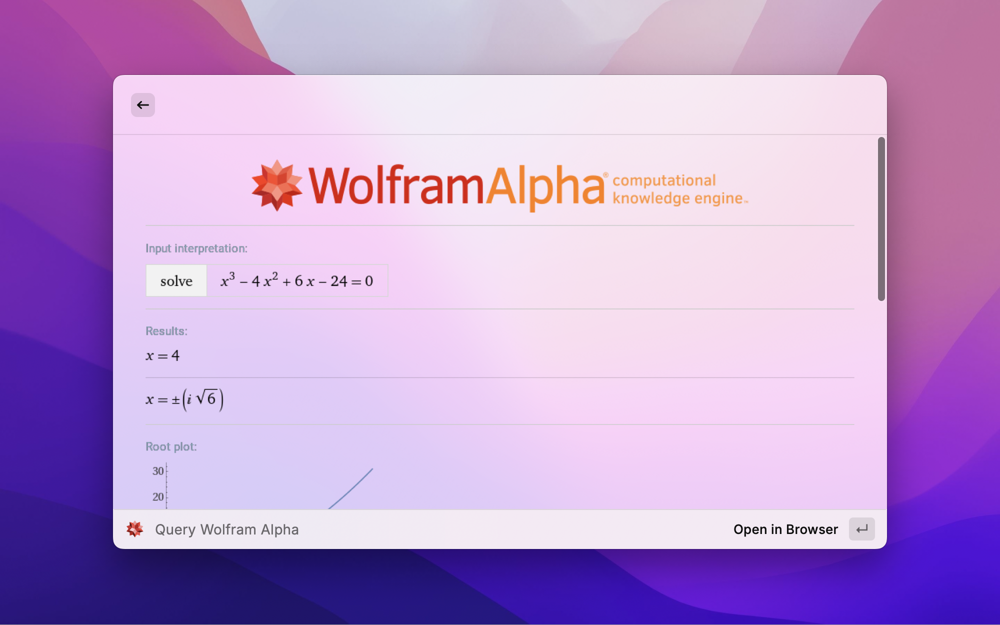

# Wolfram Alpha

_Query Wolfram Alpha from Raycast_

## Create an App ID

- Sign in the [Wolfram Alpha Developer Program](https://developer.wolframalpha.com/access)
- Click on the "Get an App ID" button
- Enter `Raycast Extension` as the title and `Query Wolfram Alpha from Raycast` as the description
- (Important!) Select **Simple API** as the API type
- Copy the generated App ID into this extension's preferences

## Acknowledgements
This extension originates from the [original extension](https://www.raycast.com/mathieudutour/wolfram-alpha)
available in the Raycast Store. As the original extension was not working, I decided to fork it and make it work again.
I've also updated the codebase to use more modern APIs.